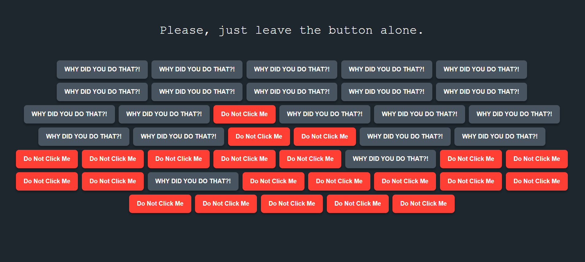
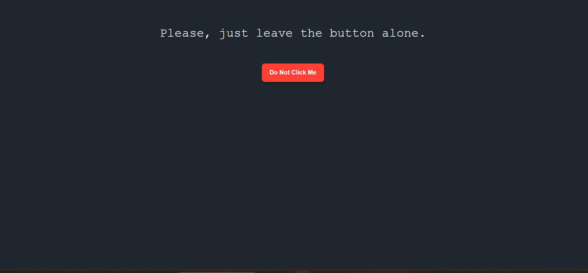
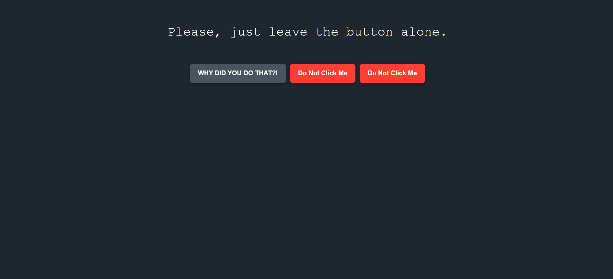

# The useless button 🎯

## Basic Details
### Team Name: Lumina

### Team Members
- Team Lead: Anagha Venugopal - College of engineering Trikaripur

### Project Description
my project is useless as it says. it just tells us not to click a button but we click it anyway and have some very useless consequences

### The Problem (that doesn't exist)
people are too productive on internet today,
there is a lack of frustration in our daily lives
Users have too much free time and nothing
completely pointless to spend it on
We needed to introduce a minor, gamified
annoyance to the daily workflow

### The Solution (that nobody asked for)
THE USELESS BUTTON, the solution for boredom

## Technical Details
### Technologies/Components Used
For Software:
- HTML
- CSS

### Implementation
For Software:
HTML,CSS,JS

# Screenshots (Add at least 3)

### Project Demo
# Link

## Team Contributions
- [Anagha Venugopal]: [Specific contributions]

---
Made with ❤️ at TinkerHub Useless Projects 

